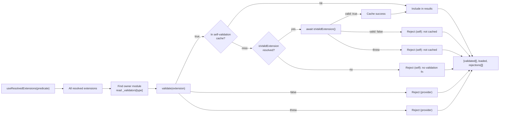
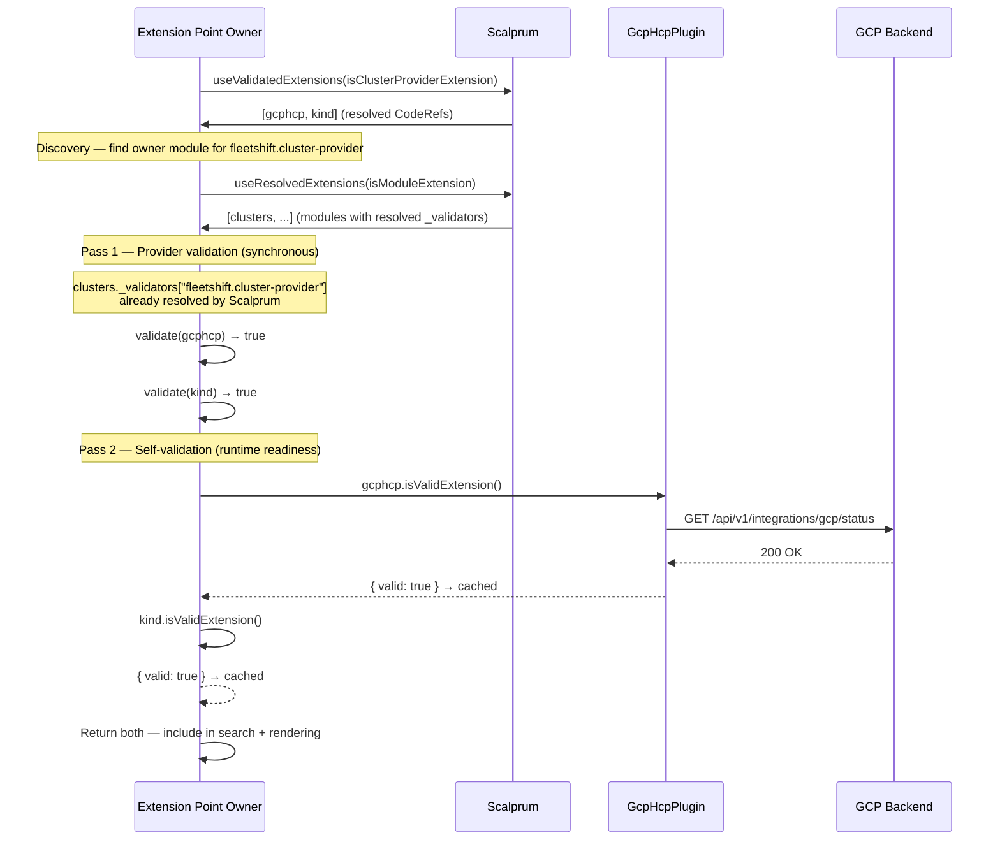
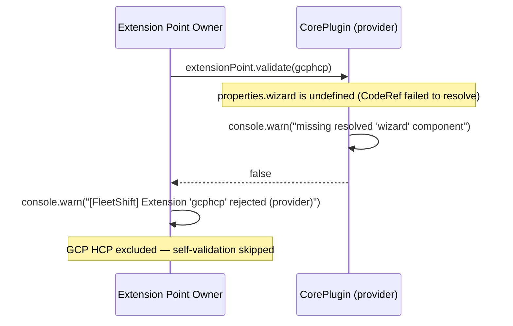
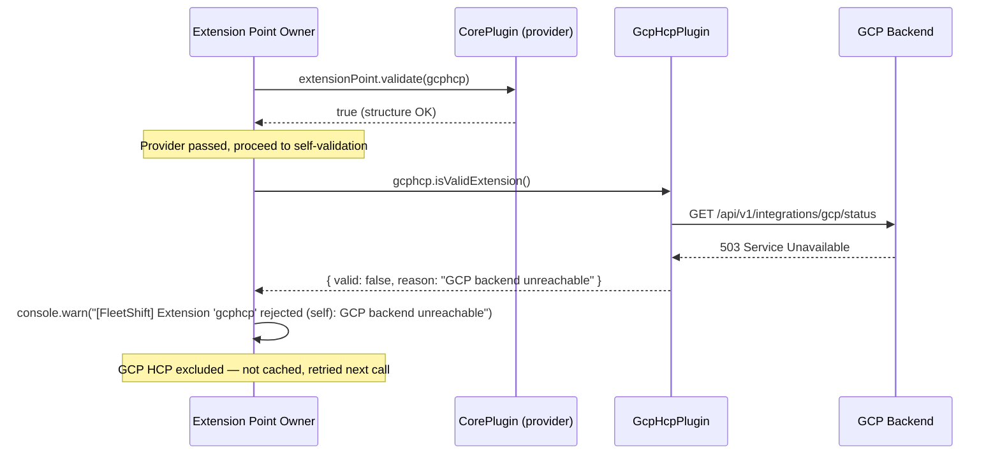

# Extension Validation — Runtime Trust Boundary for Cross-Plugin Extensions

**Epic:** [OME-3 — Addon / Extension Model](https://redhat.atlassian.net/browse/OME-3)
**Depends on:** [Feature Contracts](./feature-contracts.md)
**Status:** Draft

## Context

Any plugin can register an extension, and the shell blindly loads and renders it. The assumption is always that the environment is ready — the backend, CLI, and GUI are a tested combo. But in practice, networking issues, buggy extension bundles, or version mismatches between the backend and GUI can cause runtime crashes. There is no mechanism to prevent a broken extension from taking down the consumer's UI.

There is also no mechanism for the extension point owner to verify that an incoming extension meets its structural contract — does the cluster-provider actually expose a renderable `card` component? A `wizard`? Does the module have a resolved `component` CodeRef?

Today, the shell hardcodes type-specific validation in the build step (e.g., checking that `ClusterProviderExtras` has a `card` CodeRef string). But this only validates the manifest at build time — it cannot detect runtime failures like unresolved CodeRefs, missing MF entries, or broken module exports. The extension provider should own its validation function, not the shell.

Validation is a safety net, not a readiness gate. It prevents runtime crashes from propagating into the UI when something goes wrong in the backend/CLI/GUI combination.

The trust boundary has two sides, and **all extension types** must participate — no exemptions:

1. **Self-validation** — the extension proves it is ready (backend reachable, credentials present, feature flags set).
2. **Provider-side validation** — the extension point owner verifies the incoming extension meets its structural contract (required CodeRefs resolved, components renderable, expected shapes present).

## Design Principles

1. **All extension types.** Every extension type requires validation — `module`, `module-group`, `setup`, `cluster-provider`, `onboarding-action`, and any future types. No exemptions. The shell should not hardcode type-specific validation; the extension provider and the extension itself own their validation logic.
2. **Extension self-validates.** The extension — not the shell, not the consuming feature — provides its own validation function via `isValidExtension`. The extension knows its own prerequisites (backend reachable, credentials present, feature flags set). For simpler types like `module`, this may just return `{ valid: true }`.
3. **Provider validates structure.** The extension point owner — the module that declares the extension point — provides a `validate` function that receives the resolved extension and checks whether it meets the structural contract (required CodeRefs resolved, components renderable). This is the "do you have a Card component?" check. This replaces the hardcoded per-type validation that currently lives in the extension point owner.
4. **Fail-closed.** If either validation fails — self-validation (`isValidExtension` missing, throws, or returns `{ valid: false }`) or provider validation (`validate` rejects the extension) — the extension is rejected. No extension is surfaced without both affirmative checks.
5. **Async.** Self-validation takes no arguments (the extension knows what to check) and may make network calls. Provider validation receives the resolved extension properties and inspects their structure.
6. **Observable.** Rejection reasons are logged to the console and surfaced on the `/debug` page. Plugin developers can diagnose why their extension is not appearing. Rejections distinguish between self-validation failures and provider-validation failures.
7. **On demand.** Validation runs when the extension point owner resolves and consumes extensions via `useValidatedExtensions`, not at application cold start. Each consumer validates only the extension types it cares about, when it needs them. Validation requires extension resolution (loading remote MF chunks), so it must not run in contexts that should stay lazy — e.g., the search index is built from backend metadata without resolving extensions or running validation.
8. **Cached on success.** Successful self-validation results are cached — subsequent `useValidatedExtensions` calls skip re-validation for already-validated extensions. Failed self-validations are **not** cached, giving the extension a chance to recover (e.g., backend comes back up). The cache is invalidated when the backend signals an orchestration change (new plugin installed, plugin removed).

## Types

### `ExtensionValidationResult`

New type in `packages/build-utils/src/extensions/types.ts`. Used exclusively by self-validation (`isValidExtension`). Provider validation returns boolean only — reasons are logged inside the function.

```typescript
/**
 * Result returned by an extension's isValidExtension function.
 * Called when the extension point owner requests extensions via useValidatedExtensions.
 * NOT used by provider-side validate — that returns boolean and logs reasons internally.
 */
export type ExtensionValidationResult = {
  valid: boolean;
  reason?: string;
};
```

### Updated `BaseExtensionProperties`

`isValidExtension` moves to the base type so all extension types inherit it:

```typescript
export type BaseExtensionProperties = {
  id: string;
  label: string;
  description?: string;
  keywords?: string[];
  searchResult?: EncodedCodeRef;
  searchIcon?: EncodedCodeRef;
  /** Required. Async function called when the extension point owner
   *  requests extensions. Must return { valid: true } or the extension
   *  is rejected and never surfaced to that consumer. */
  isValidExtension: EncodedCodeRef;
};
```

### Updated `ExtensionPointDeclaration`

The extension point declaration gains a required `validate` CodeRef. The extension point owner provides a function that receives each incoming extension's resolved properties and checks whether they meet the structural contract.

```typescript
export type ExtensionPointDeclaration = {
  description: string;
  type: string;
  /** Required. CodeRef to a synchronous predicate called with each
   *  resolved extension of this type. Must honor the same contract as
   *  useResolvedExtensions' ExtensionPredicate — synchronous, returns
   *  boolean. Rejection reasons can only be logged inside the function.
   *
   *  Signature: (extension: Extension) => boolean
   *
   *  The type check comes first (does this extension belong here?),
   *  then structural checks (are CodeRefs resolved to functions?). */
  validate: EncodedCodeRef;
};
```

The `validate` function is provided by the module that declares the extension point — the "provider" side of the trust boundary. For example, a core plugin that declares `fleetshift.cluster-provider` as an extension point can validate that incoming cluster-provider extensions actually resolve their `card`, `wizard`, and `icon` CodeRefs to renderable components.

### Generic `ExtensionProperties<TExtras>`

The current intersection approach (`BaseExtensionProperties & ModuleGroupExtras`) allows extras to accidentally shadow base properties like `id`, `label`, or `isValidExtension`. A generic type prevents this — the base properties are non-overridable:

```typescript
/**
 * Generic extension properties type. TExtras keys that collide with
 * BaseExtensionProperties are stripped — the base always wins.
 * This guarantees isValidExtension, id, label, etc. cannot be
 * overridden by any extras type.
 */
export type ExtensionProperties<
  TExtras extends Record<string, unknown> = Record<string, unknown>,
> = BaseExtensionProperties & Omit<TExtras, keyof BaseExtensionProperties>;
```

All per-type aliases become parameterized:

```typescript
export type ModuleGroupProperties = ExtensionProperties<ModuleGroupExtras>;
export type ModuleProperties = ExtensionProperties<ModuleExtras>;
export type SetupProperties = ExtensionProperties<SetupExtras>;
export type ClusterProviderProperties = ExtensionProperties<ClusterProviderExtras>;
export type OnboardingActionProperties = ExtensionProperties<OnboardingActionExtras>;
```

The `FleetshiftExtension` generic also uses it:

```typescript
export type FleetshiftExtension<
  TType extends string = string,
  TExtra extends Record<string, unknown> = Record<string, unknown>,
> = {
  type: TType;
  properties: ExtensionProperties<TExtra>;
};
```

This gives full control: `BaseExtensionProperties` is the mandatory, non-overridable contract. Extras add type-specific fields but cannot weaken the base.

### Runtime types

New file `packages/common/src/validation.ts` (re-exported from `@fleetshift/common`). These types live in common because any plugin can be an extension point owner — not just the shell:

```typescript
export type ExtensionValidationResult = {
  valid: boolean;
  reason?: string;
};

export type ValidationRejectionSource = "self" | "provider";

export type ValidationRejection = {
  extensionId: string;
  extensionType: string;
  pluginName: string;
  reason: string;
  /** Which validation rejected: "self" (isValidExtension) or
   *  "provider" (extension point's validate function). */
  source: ValidationRejectionSource;
};

/** Cache for self-validation results. Only successful validations are
 *  cached. Failed validations are retried on each useValidatedExtensions
 *  call. Cache is invalidated on orchestration change signals from the
 *  backend (new plugin installed, plugin removed). */
export type SelfValidationCache = Map<
  string, // extensionId
  { valid: true; timestamp: number }
>;
```

## Build-Time Changes

### Validator additions

Since `isValidExtension` moves to `BaseExtensionProperties`, every extension type is validated. The base property validation (shared across all types) gains the CodeRef check:

```typescript
// In validateBaseProperties() (shared by all type validators):
...validateCodeRef(props.isValidExtension, "isValidExtension", ctx),
```

Additionally, `ExtensionPointDeclaration.validate` is now required. The extension point validation in `validateModuleProperties()` checks:

```typescript
// In validateModuleProperties(), for each extensionPoint:
...validateCodeRef(ep.validate, "extensionPoints[type].validate", ctx),
```

Build fails if `isValidExtension` is missing on any extension, or if `validate` is missing on any extension point declaration.

### Existing validation handles the rest

The existing `extractCodeRefs()` + `exposedModules` check in `validateExtensionSet()` already walks all properties looking for CodeRefs. The new CodeRefs (`isValidExtension` on extensions, `validate` on extension points) are automatically checked against `exposedModules` — no changes needed to the set-level validator.

### Builder impact

All builder functions (`createModule()`, `createModuleGroup()`, `createSetup()`, `createClusterProvider()`, `createOnboardingAction()`) accept properties including `BaseExtensionProperties`. Since `BaseExtensionProperties` now has a required `isValidExtension: EncodedCodeRef`, TypeScript enforces that all callers provide it. No builder function code changes needed — only the type change.

For `createModule()`, `extensionPoints` entries now require a `validate` CodeRef. TypeScript enforces this through the updated `ExtensionPointDeclaration` type.

**Affected code:** `packages/build-utils/src/extensions/validate.ts`, `packages/build-utils/src/extensions/types.ts`

## Runtime Changes

### New hook: `useValidatedExtensions`

New file `packages/common/src/useValidatedExtensions.ts` (re-exported from `@fleetshift/common`). Any plugin that owns an extension point needs this hook:

```typescript
function useValidatedExtensions<T extends Extension>(
  predicate: ExtensionPredicate<T>,
): [
  extensions: LoadedAndResolvedExtension<T>[],
  loaded: boolean,
  rejections: ValidationRejection[],
];
```

The hook wraps `useResolvedExtensions` — it is a layer on top, not a replacement. It runs two validation passes sequentially. Provider validation runs first because it filters out structurally broken extensions before we attempt to load and call their self-validation functions.

**Pass 1 — Provider validation (extension point owner checks structure):**

1. Calls `useResolvedExtensions(predicate)` to get all resolved extensions
2. For each extension, looks up the extension point declaration on the module that owns the type
3. Resolves the extension point's `validate` CodeRef and calls it synchronously with the full extension object — honoring the same `(extension) => boolean` contract as `useResolvedExtensions`' `ExtensionPredicate`
4. Extensions where `validate` returned `false` or threw are rejected with `source: "provider"`. Rejection reasons are logged inside the validate function itself (via `console.warn`), not returned — the hook only sees a boolean

This is the "static" structural check — does the extension have the right shape? Are required CodeRefs resolved to actual components? Extensions that fail here are broken manifests and there is no point calling their self-validation.

**Pass 2 — Self-validation (extension proves runtime readiness):**

5. For each extension that passed provider validation, checks the `SelfValidationCache` — if a `{ valid: true }` entry exists, the extension passes
6. For uncached extensions, checks for a resolved `isValidExtension` function
7. Calls `isValidExtension()` — async, no args
8. On `{ valid: true }`: caches the result (keyed by extension ID)
9. On failure (missing, threw, `{ valid: false }`): rejected with `source: "self"`, **not** cached (retried next call)

**Finalization:**

10. Collects all rejections (from both passes) with reasons and source
11. Logs rejections to console via `console.warn`
12. Returns only fully validated extensions + the rejections array for `/debug`



### Provider validation discovery and module loading

The hook must find and load the provider's `validate` function automatically — the developer using `useValidatedExtensions` does not provide the validator. The hook wires it internally so the validation cannot be skipped or faked.

**The problem:** `extensionPoints` declarations (and their `validate` CodeRefs) are nested inside module extension properties. Scalprum's automatic CodeRef resolution only processes top-level extension properties — it does not walk into nested objects like `extensionPoints.providers.validate`. The hook must resolve the validate CodeRef manually.

**Discovery flow:**

1. Given the extension type being queried (e.g., `fleetshift.cluster-provider`), the hook walks all resolved module extensions to find the one whose `extensionPoints` declares a matching `type`.
2. From the matching module extension, the hook reads the `validate` CodeRef string (e.g., `"ClusterProviderValidator.validate"`).
3. It parses the CodeRef into `moduleName` (`ClusterProviderValidator`) and `exportName` (`validate`).
4. It determines the owning plugin's scope from the module extension's plugin metadata — the `pluginName` (e.g., `core-plugin`).
5. It calls `pluginStore.getExposedModule(pluginName, moduleName)` to load the MF module at runtime.
6. It reads the named export from the loaded module and calls it synchronously.

**Why the hook does this, not the developer:** If the extension point owner's component called its own validate function, nothing would prevent a developer from registering a validate CodeRef that always returns `true` and never using it. By having the hook discover and call the function independently, validation is enforced by the infrastructure — the developer only needs to implement the function, not remember to call it.

**Registry requirements:**

The plugin registry served by the backend must include enough information for the hook to resolve the validate CodeRef:

1. **`extensionPoints` with `validate` CodeRef** — already on module extension properties (new field added by this design). The backend's Go `extension` struct uses `Properties map[string]interface{}`, so nested CodeRefs pass through as-is.

2. **`exposedModules` on `pluginManifest`** — maps module names to file paths. Currently **missing from the backend response** — the Go `pluginManifest` struct only includes `Name`, `Version`, `Extensions`, `RegistrationMethod`, `BaseURL`, and `LoadScripts`. The `exposedModules` field must be added.

Current backend struct (missing `exposedModules`):

```go
type pluginManifest struct {
    Name               string      `json:"name"`
    Version            string      `json:"version"`
    Extensions         []extension `json:"extensions"`
    RegistrationMethod string      `json:"registrationMethod"`
    BaseURL            string      `json:"baseURL"`
    LoadScripts        []string    `json:"loadScripts"`
}
```

Required change:

```go
type pluginManifest struct {
    Name               string                 `json:"name"`
    Version            string                 `json:"version"`
    Extensions         []extension            `json:"extensions"`
    ExposedModules     map[string]string      `json:"exposedModules,omitempty"`
    RegistrationMethod string                 `json:"registrationMethod"`
    BaseURL            string                 `json:"baseURL"`
    LoadScripts        []string               `json:"loadScripts"`
}
```

The `exposedModules` map is already present in the build-time `plugin-manifest.json` — the backend just needs to stop stripping it. The build writes entries like `{ "ClusterProviderValidator": "./src/plugins/core-plugin/clusterProviderValidator.ts" }`. At runtime, `pluginStore.getExposedModule("core-plugin", "ClusterProviderValidator")` uses the MF container (loaded via `loadScripts`) to resolve this module — the file path itself is not used at runtime, only the key.

**`_validators` hoisting at build time:**

Scalprum's CodeRef resolution only processes top-level extension properties — it does not walk into nested objects like `extensionPoints.providers.validate`. The `FleetshiftPlugin` build step hoists the `validate` CodeRef into a top-level `_validators` property so Scalprum auto-resolves it:

```typescript
// Build-time generated — FleetshiftPlugin hoists extensionPoint validators
// into a top-level _validators property that Scalprum will auto-resolve
{
  "type": "fleetshift.module",
  "properties": {
    "id": "clusters",
    "component": { "$codeRef": "ClustersModule.default" },
    "extensionPoints": { ... },
    "_validators": {
      "fleetshift.cluster-provider": { "$codeRef": "ClusterProviderValidator.validate" }
    }
  }
}
```

By the time `useResolvedExtensions` returns the module extension, `_validators["fleetshift.cluster-provider"]` is already a resolved function — no manual module loading needed. The `_` prefix signals this is an internal build-generated property. The hook reads it from the resolved module extension and calls it directly. The `FleetshiftPlugin` build step already walks extension properties — adding the hoist is mechanical.

**Edge case access:** The validate function is also accessible via `pluginStore.getExposedModule` for edge cases — debugging, manual re-validation, or extension point owners who want to call their own validator explicitly in component code. The `exposedModules` entry guarantees the function is loadable by any consumer.

### Consumption site changes

Call sites that resolve extensions for rendering switch to `useValidatedExtensions`. Search does not — it builds its index from backend metadata without resolving extensions:

| File | Current call | Change |
|------|-------------|--------|
| `SearchProvider.tsx` | `useResolvedExtensions(…)` | → Builds index from plugin registry metadata (no extension resolution, no validation). CodeRefs resolved lazily on display. |
| `AppNav.tsx` (line 74) | `useResolvedExtensions(isModuleExtension)` | → `useValidatedExtensions(isModuleExtension)` |
| `useSetupExtensions.ts` (line 43) | `useResolvedExtensions(isSetupExtension)` | → `useValidatedExtensions(isSetupExtension)` |

## Example: Cluster Provider Validation (both sides)

### Before (current — will fail build after this change)

```typescript
// Extension — no isValidExtension
createClusterProvider({
  id: "gcphcp",
  label: "GCP Hosted Control Plane",
  description: "Create a managed OpenShift cluster on Google Cloud Platform.",
  icon: { $codeRef: "GcpHcpProviderCard.GcpHcpIcon" },
  card: { $codeRef: "GcpHcpProviderCard.default" },
  wizard: { $codeRef: "CreateGcpHcpWizard.default" },
  // No isValidExtension — build fails
})

// Extension point — no validate
createModule({
  id: "core-clusters",
  label: "Clusters",
  component: { $codeRef: "ClustersPage.default" },
  icon: { $codeRef: "ClustersPage.ClustersIcon" },
  extensionPoints: {
    "fleetshift.cluster-provider": {
      description: "Cluster creation providers",
      type: "fleetshift.cluster-provider",
      // No validate — build fails
    },
  },
})
```

### After

```typescript
// Extension — with isValidExtension (self-validation)
createClusterProvider({
  id: "gcphcp",
  label: "GCP Hosted Control Plane",
  description: "Create a managed OpenShift cluster on Google Cloud Platform.",
  icon: { $codeRef: "GcpHcpProviderCard.GcpHcpIcon" },
  card: { $codeRef: "GcpHcpProviderCard.default" },
  wizard: { $codeRef: "CreateGcpHcpWizard.default" },
  isValidExtension: { $codeRef: "GcpHcpValidation.isValid" },
})

// Extension point — with validate (provider-side validation)
createModule({
  id: "core-clusters",
  label: "Clusters",
  component: { $codeRef: "ClustersPage.default" },
  icon: { $codeRef: "ClustersPage.ClustersIcon" },
  extensionPoints: {
    "fleetshift.cluster-provider": {
      description: "Cluster creation providers",
      type: "fleetshift.cluster-provider",
      validate: { $codeRef: "ClusterProviderValidator.validate" },
    },
  },
})
```

### Self-validation function (extension-provided)

New file exposed via `exposedModules: { GcpHcpValidation: "./src/plugins/gcphcp-plugin/validate.ts" }`:

```typescript
import type { ExtensionValidationResult } from "@fleetshift/build-utils";

// What this function checks depends on the extension's contract with the
// backend. The base check (endpoint reachability) may change as the
// extension's requirements evolve — e.g., verifying specific API versions,
// checking credential scopes, or validating backend feature flags.
export async function isValid(): Promise<ExtensionValidationResult> {
  try {
    const response = await fetch("/api/v1/integrations/gcp/status");
    if (!response.ok) {
      return { valid: false, reason: `GCP backend returned ${response.status}` };
    }
    return { valid: true };
  } catch (e) {
    return { valid: false, reason: `GCP backend unreachable: ${e}` };
  }
}
```

### Provider-side validation function

The module that declares `fleetshift.cluster-provider` as an extension point provides a `validate` function. This function receives each incoming extension's resolved properties and checks structural conformance.

In the module's extension point declaration (in the plugin's `extensions` array via `createModule`):

```typescript
createModule({
  id: "core-clusters",
  label: "Clusters",
  component: { $codeRef: "ClustersPage.default" },
  icon: { $codeRef: "ClustersPage.ClustersIcon" },
  extensionPoints: {
    "fleetshift.cluster-provider": {
      description: "Cluster creation providers shown in the Create Cluster wizard",
      type: "fleetshift.cluster-provider",
      validate: { $codeRef: "ClusterProviderValidator.validate" },
    },
  },
})
```

The validation function exposed via `exposedModules: { ClusterProviderValidator: "./src/plugins/core-plugin/clusterProviderValidator.ts" }`:

```typescript
// Synchronous predicate — honors the useResolvedExtensions ExtensionPredicate
// contract: (extension) => boolean. Reasons logged internally because the
// hook only sees true/false. By the time this runs, Scalprum has resolved
// CodeRefs to actual functions (async () => {…}).
export function validate(
  extension: { type: string; properties: Record<string, unknown> },
): boolean {
  if (extension.type !== "fleetshift.cluster-provider") {
    console.warn(`[ClusterProviderValidator] Unexpected type: ${extension.type}`);
    return false;
  }
  const { properties } = extension;
  if (typeof properties.card !== "function") {
    console.warn(`[ClusterProviderValidator] Extension '${properties.id}': missing resolved 'card' component`);
    return false;
  }
  if (typeof properties.wizard !== "function") {
    console.warn(`[ClusterProviderValidator] Extension '${properties.id}': missing resolved 'wizard' component`);
    return false;
  }
  if (typeof properties.icon !== "function") {
    console.warn(`[ClusterProviderValidator] Extension '${properties.id}': missing resolved 'icon' component`);
    return false;
  }
  return true;
}
```

This catches the case where a CodeRef is present in the manifest but fails to resolve at runtime (module not loaded, export missing, typo in the CodeRef string). Self-validation cannot catch this — the extension author's `isValidExtension()` runs in their own plugin scope and may not know whether Scalprum resolved its CodeRefs correctly from the consumer's perspective.

### Manifest output

Extension manifest (cluster-provider with `isValidExtension`):

```json
{
  "type": "fleetshift.cluster-provider",
  "properties": {
    "id": "gcphcp",
    "label": "GCP Hosted Control Plane",
    "description": "Create a managed OpenShift cluster on Google Cloud Platform.",
    "icon": { "$codeRef": "GcpHcpProviderCard.GcpHcpIcon" },
    "card": { "$codeRef": "GcpHcpProviderCard.default" },
    "wizard": { "$codeRef": "CreateGcpHcpWizard.default" },
    "isValidExtension": { "$codeRef": "GcpHcpValidation.isValid" }
  }
}
```

Module manifest (extension point owner with `_validators` hoisted at build time):

```json
{
  "type": "fleetshift.module",
  "properties": {
    "id": "clusters",
    "label": "Clusters",
    "component": { "$codeRef": "ClustersModule.default" },
    "icon": { "$codeRef": "ClustersIcon.default" },
    "extensionPoints": {
      "providers": {
        "description": "Cluster providers available in the creation wizard",
        "type": "fleetshift.cluster-provider",
        "validate": { "$codeRef": "ClusterProviderValidator.validate" }
      }
    },
    "_validators": {
      "fleetshift.cluster-provider": { "$codeRef": "ClusterProviderValidator.validate" }
    }
  }
}
```

The `_validators` property is generated by the `FleetshiftPlugin` build step — the developer only writes `extensionPoints.*.validate`. The build hoists the CodeRef into `_validators` keyed by extension point type so Scalprum auto-resolves it alongside other top-level CodeRefs.

### Runtime flow



### Rejection scenario — provider-side validation failure



### Rejection scenario — self-validation failure



## Search and Navigation Impact

- **Search index: built from backend metadata, not resolved extensions.** The search index is built from static metadata already present in the plugin registry response (title, description, keywords) — no remote chunk loading required. CodeRefs (icons, search result components) are resolved lazily only when a search result is displayed. Validation does **not** run at index build time because it would require resolving extensions, which would force-load all remote MF chunks and defeat lazy loading. Validation runs when the extension point owner actually consumes the extension for rendering.
- **Navigation (`AppNav`)** switches to `useValidatedExtensions(isModuleExtension)` — extensions are resolved for rendering, and validation runs at that point.

## Debug Page

The `/debug` page (`packages/gui/src/pages/DebugPage.tsx`) gains a new accordion panel:

- **"Extension Validation"** panel showing:
  - Count: N validated, M rejected
  - Per rejection: extension ID, type, plugin name, reason, source (`self` or `provider`)
  - Per validated: extension ID, type, plugin name, checkmark
- A Scalprum shared store is exposed by the shell and populated by `useValidatedExtensions`. Consumed cross-MF via a `useValidationResults` hook (re-exported from `@fleetshift/common`) — no React context provider or additional singletons needed.
- Rejections are grouped by source so developers can quickly distinguish "my backend is down" (self) from "my CodeRefs didn't resolve" (provider).

## Migration

### Phase 1: Types and Build Validation (packages/build-utils)

1. Add `ExtensionValidationResult` type to `types.ts`.
2. Add required `isValidExtension: EncodedCodeRef` to `BaseExtensionProperties` (all types inherit it).
3. Add required `validate: EncodedCodeRef` to `ExtensionPointDeclaration`.
4. Add `isValidExtension` CodeRef validation to the shared base property validator (applies to all types).
5. Add `validate` CodeRef validation to extension point declaration checks in `validateModuleProperties()`.
6. Add `_validators` hoisting to `FleetshiftPlugin` — during manifest generation, walk each module extension's `extensionPoints`, and emit a top-level `_validators` property mapping each extension point `type` to its `validate` CodeRef. This ensures Scalprum auto-resolves the validator alongside other top-level CodeRefs.
7. Update all test fixtures in `validate.test.ts` and `builders.test.ts` to include `isValidExtension`, `validate`, and `_validators`.
8. Export `ExtensionValidationResult` from `index.ts`.

### Phase 1.5: Backend Registry (fleetshift-poc)

1. Add `ExposedModules map[string]string` field to the Go `pluginManifest` struct in `uiconfig.go`. This field already exists in the build-time `plugin-manifest.json` — the backend currently strips it because the struct does not define it.
2. The `exposedModules` field enables edge-case direct access via `pluginStore.getExposedModule()` for debugging and manual re-validation. The primary resolution path (`_validators` hoisting) does not depend on it.

### Phase 2: Runtime Types and Hook

1. Add `validation.ts` with runtime types (including `ValidationRejectionSource`, `SelfValidationCache`) to `packages/common/src/` and re-export from `@fleetshift/common`. Plugins that own extension points need these types.
2. Add `useValidatedExtensions.ts` hook in `packages/common/src/` — implements both self-validation and provider-validation passes with caching. Available to any plugin, not just the shell.
3. Add extension point `validate` CodeRef resolution logic (lookup extension point declaration from parent module, resolve `validate` CodeRef).
4. Create a Scalprum shared store for validation results in `packages/gui/` (shell exposes it). Add `useValidationResults` hook in `packages/common/` — wraps the Scalprum store accessor, re-exported from `@fleetshift/common` so any plugin can read validation state without depending on React context or singletons.

### Phase 3: Consumption Site Migration

1. Migrate `SearchProvider.tsx` to build the index from plugin registry metadata (no extension resolution). CodeRefs resolved lazily on result display only.
2. Update `AppNav.tsx` to use `useValidatedExtensions(isModuleExtension)`.
3. Update `useSetupExtensions.ts` to use `useValidatedExtensions(isSetupExtension)`.

### Phase 4: Plugin Updates (packages/mock-ui-plugins)

1. Add `isValidExtension` CodeRef to **all** extensions across all plugins (module, module-group, setup, cluster-provider, onboarding-action).
2. Implement self-validation functions and expose them in `exposedModules`. For simple types, a trivial `() => ({ valid: true })` is acceptable.
3. Add `validate` CodeRef to **all** extension point declarations on modules.
4. Implement provider-validation functions and expose them in `exposedModules`. These check structural contract (e.g., cluster-provider validator checks `card`, `wizard`, `icon` are resolved functions; module validator checks `component` is a resolved function).

### Phase 5: Debug Page

1. Add "Extension Validation" accordion panel to `DebugPage.tsx`.
2. Wire up `useValidationResults` (Scalprum shared store) to display rejections.

## Decisions

- **Two-sided trust boundary.** Validation has two independent passes: self-validation (extension proves readiness) and provider validation (extension point owner checks structure). Both must pass. This covers the full trust boundary — the extension knows its own health, and the provider knows its own contract.
- **All extension types.** Every extension type requires `isValidExtension`, and every extension point declaration requires `validate`. No exemptions for "plugin-internal" types. The shell should not hardcode per-type validation — the extension and the extension point owner are the experts on their own contracts. For simpler types (e.g., `module-group`), validation may just return `{ valid: true }`, but the function must exist. This also future-proofs the system for custom extension types from the addon model.
- **Provider validation is required.** The `validate` CodeRef on `ExtensionPointDeclaration` is required. Every extension point owner must provide structural validation. This replaces the current approach where the shell hardcodes type-specific checks (e.g., "cluster-provider must have a card CodeRef"). The provider knows its own contract — the shell doesn't.
- **Self-validation: no-arg, async.** The self-validation function receives no arguments because the extension itself knows what conditions to check. The shell does not know the extension's prerequisites. Async allows network calls for health checks.
- **Provider validation: synchronous boolean predicate.** The provider's `validate` function honors the same `(extension) => boolean` contract as `useResolvedExtensions`' `ExtensionPredicate` — synchronous, returns boolean. It receives the full extension object (type + resolved properties) and inspects whether CodeRefs resolved to actual functions/components. Rejection reasons are logged inside the function (via `console.warn`) because the hook only sees `true`/`false`. The provider knows its own contract — which properties are required and what shape they should have.
- **Fail-closed.** Missing `isValidExtension`, thrown errors, and `{ valid: false }` all result in rejection. Provider `validate` that throws also rejects. This prevents broken extensions from polluting other plugins' UIs. The cost of a false negative (valid extension rejected) is lower than a false positive (broken extension shown).
- **Provider before self.** Provider validation runs first. It checks whether the extension's resolved properties meet the structural contract — are required CodeRefs resolved to actual components? If the structure is broken, the extension's own `isValidExtension` function may not even be loadable. Provider filters out broken manifests before we attempt to execute extension-provided code.
- **On-demand, not global.** Validation runs when an extension point owner calls `useValidatedExtensions`, not at application cold start. Each consumer validates only the types it needs, when it needs them. This avoids unnecessary work at startup and keeps validation scoped to the consumer.
- **Cache successes, retry failures.** Successful self-validation results are cached in a shared `SelfValidationCache` (keyed by extension ID). Subsequent `useValidatedExtensions` calls from any consumer skip self-validation for cached extensions. Failed results are **not** cached — each call retries, giving the extension a chance to recover (e.g., backend restarts). The cache is invalidated when the backend signals an orchestration change (new plugin installed/removed), ensuring newly available or removed extensions are re-evaluated. Provider validation is not cached — it runs every time because the provider's contract may evolve independently.
- **Not cached across page loads.** Each browser session re-validates. This is intentional — extension validity can change (backend goes down, credentials expire). Re-validation on refresh is cheap since the check is a single lightweight API call per extension.
- **Hook wires validation internally.** The `useValidatedExtensions` hook discovers and calls the provider's validate function automatically — the consumer does not pass a validator, and the extension point owner cannot skip it. This prevents the case where a developer registers a validate CodeRef but never calls it. The hook is the enforcement point; the developer only implements the function.
- **`_validators` hoisting at build time.** The `FleetshiftPlugin` build step hoists `validate` CodeRefs from `extensionPoints` declarations into a top-level `_validators` property on the module extension. This lets Scalprum auto-resolve them alongside other CodeRefs. Without hoisting, Scalprum would not resolve nested `extensionPoints` objects, and the hook would need to manually parse CodeRef strings and call `getExposedModule`. Hoisting avoids that complexity — the hook just reads the already-resolved function. The `_` prefix signals this is an internal build-generated property.
- **`exposedModules` in backend registry.** The Go `pluginManifest` struct must include `ExposedModules map[string]string` so the registry serves it. The build already writes these entries; the backend currently strips them. Adding the field enables edge-case direct access via `getExposedModule` for debugging and manual re-validation.
- **`reason` is developer-facing.** Rejection reasons appear in the console and `/debug` page, not in the main UI. End users simply do not see invalid extensions. The `source` field on rejections helps developers locate the problem: their own plugin (`self`) or the consumer's expectations (`provider`).

## Open Questions

- [ ] ~~**Periodic re-validation:**~~ Not pursuing. Will revisit once the catalog concept is in progress — catalog may introduce its own invalidation model that makes timer-based re-validation redundant.
- [ ] **Validation timeout:** Not for initial implementation. Possible enhancement: if `isValidExtension()` hangs, render a loader placeholder for that extension and continue rendering the rest. A 1–2 second timeout with deferred resolution would keep the UI responsive without hard-rejecting slow extensions.
- [ ] **User-facing rejection UI:** Currently, rejected extensions are invisible. Should there be a "some features unavailable" banner? UX input needed.
- [ ] **Backend-side validation:** Possible future expansion. The Go backend could validate extensions before including them in the UI config response, preventing the shell from even loading the MF entry. Requires a shared validation contract between UI and backend (different languages, no shared types today) — out of scope for initial implementation.
- [x] **Extension point discovery:** Resolved — see "Provider validation discovery and module loading" section. The hook walks resolved module extensions to find the owner, reads the `_validators` property (hoisted at build time from `extensionPoints` declarations), and calls the already-resolved function. The `_validators` approach avoids manual `getExposedModule` calls and works from any package. The `exposedModules` field must be added to the backend's Go `pluginManifest` struct for edge-case direct access.
